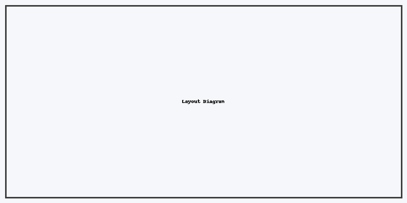

*A production-ready blog post scaffold you can copy/paste.*  
It’s fully **mobile-first**, accessible, and takes advantage of Docusaurus blog features: frontmatter, excerpts, images, code blocks, callouts, and SEO.

<!-- truncate -->

## What you’ll get

- Clean frontmatter with SEO (`title`, `description`, `image`, `keywords`).
- Responsive images with ALT text and captions.
- Copy-ready sections for: Overview → Steps → Code → Tips → FAQ.
- Admonitions (`:::tip`, `:::warning`) and tables.
- Sample diagram and checklists.

> **Heads up**: This file is pure Markdown/MDX. You can extend it with JSX if needed, but it works great out of the box.

---

## 1) Frontmatter & SEO (copy/paste)

```yaml
---
slug: responsive-blog-page
title: Build a Responsive, Detailed Blog Page (Step-by-Step, Markdown/MDX)
description: A complete, mobile-first blog template for Docusaurus with SEO, images, code, callouts, and best practices—written entirely in Markdown/MDX.
authors: [James Muchiri]
tags: [blog, markdown, docusaurus, responsive, seo, mdx]
image: ./cover-1200x630.png
keywords: [docusaurus blog, markdown blog page, responsive blog, author pages]
toc_min_heading_level: 2
toc_max_heading_level: 4
---
```

**Why this matters**
- `image` is used for social cards (Open Graph) and looks great when shared.
- `authors` must match a key in `blog/authors.yml`.
- `toc_*` keeps your ToC tidy on mobile.

---

## 2) Hero: lead paragraph + cover image

A short, crisp intro makes your excerpt useful in lists and RSS.


*Figure: The cover image is 1200×630 for optimal social sharing.*

---

## 3) Steps (mobile-first)

### Step 1 — Structure your headings
Keep headings compact (H2–H4). Long headings wrap poorly on mobile.

### Step 2 — Write scannable paragraphs
Use short paragraphs (2–4 lines) and bullets for dense info.

### Step 3 — Add code blocks with titles
```tsx title="Example React snippet"
export default function Hello() {
  return <h1>Hello, world!</h1>;
}
```
```bash title="Handy CLI"
npm run build
npm run serve
```

### Step 4 — Add a simple diagram
The goal is clarity. ASCII works everywhere.

```
+---------------------------+
|        Header             |
+--------------+------------+
|   Content    |  Sidebar   |
+--------------+------------+
|        Footer             |
+---------------------------+
```

Or drop in an illustrative image:



### Step 5 — Use callouts for key points
:::tip
Keep your **excerpt** short by placing `<!-- truncate -->` early in the post.
:::
:::warning
Author keys in `authors.yml` must match frontmatter exactly, including spaces and casing.
:::

---

## 4) Tables (responsive-friendly)

| Feature         | Why it matters                          | Action                       |
|-----------------|-----------------------------------------|------------------------------|
| SEO `image`     | Social cards for better sharing         | Use 1200×630 PNG/JPG         |
| Consistent tags | Groups related posts                    | 3–6 relevant tags            |
| ALT text        | Accessibility + SEO                     | Describe the image context   |
| Excerpt         | Cleaner previews in lists               | Place `<!-- truncate -->`    |

---

## 5) Accessibility checklist

- [x] Images have ALT text.
- [x] Headings are nested properly (H2 → H3 → H4).
- [x] Links use descriptive labels.
- [x] Code blocks have titles if the context isn’t obvious.

---

## 6) FAQ

**Q: Can I embed React components?**  
A: Yes—this is MDX, so JSX is allowed if you need components.

**Q: Do I need a special plugin for images?**  
A: No—regular Markdown images are responsive in the default theme.

**Q: Where should I put images?**  
A: Store them near the post (e.g., `./diagram.png`) to keep posts portable.

---

## 7) Wrap-up

This post acts as a template. Duplicate it, change the frontmatter, swap the cover and you’re good to go.

Happy writing!
