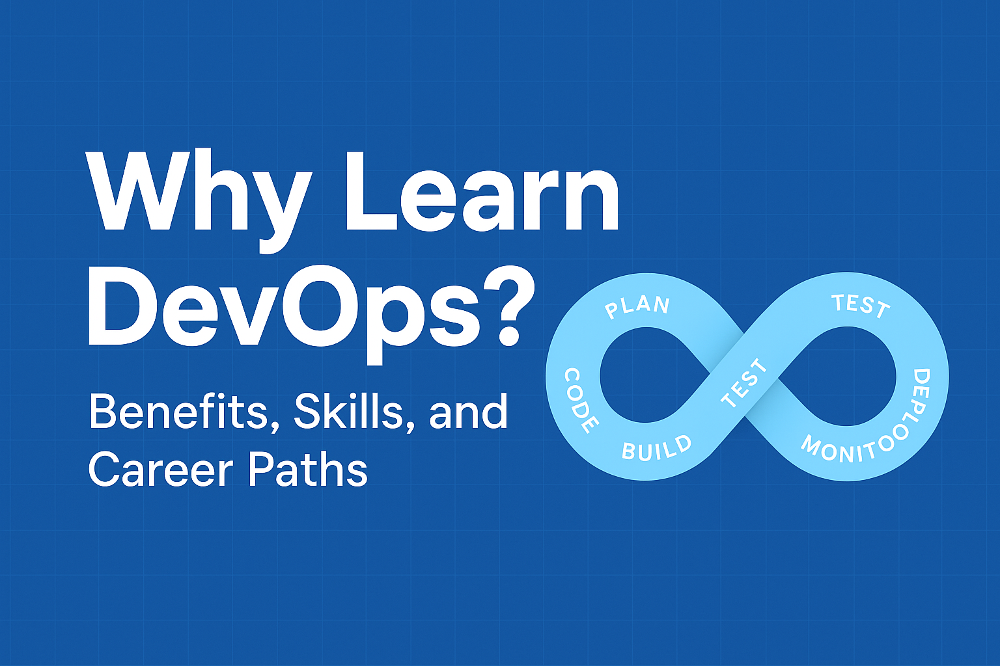

*DevOps is no longer optional—it’s the backbone of modern software delivery.*  
This post explains **why learning DevOps is worth your time**, what skills you’ll gain, and how it shapes your career.

<!-- truncate -->

## What you’ll learn in this post

- Why DevOps exists (and what problems it solves).
- The **real-world benefits** of DevOps for teams & companies.
- Core **skills and tools** you’ll master when learning DevOps.
- **Career opportunities** and job market demand.
- A practical **learning roadmap** to get started.

> **Note:** This article is written in plain Markdown/MDX. You can extend it with JSX if you want (charts, callouts, embeds), but it works perfectly in Docusaurus as-is.

---

## 1) What is DevOps, really?

At its core, DevOps is a **culture + set of practices** that integrates **development (Dev)** and **operations (Ops)** to shorten the software delivery lifecycle.  

Instead of working in silos, DevOps teams collaborate to **plan, build, test, deploy, and monitor software continuously.**

*Figure: The DevOps lifecycle—continuous improvement at every stage.*

---

## 2) Why learn DevOps?

### 🚀 Faster delivery
DevOps enables rapid releases without sacrificing stability.

### 🛠 Better collaboration
Bridges the gap between dev, QA, and ops teams—reducing friction.

### ⚡ Automation everywhere
From testing to deployment, repetitive tasks are automated.

### 📈 High demand in the job market
Companies across industries are adopting DevOps as a standard.

---

## 3) Key skills you’ll gain

| Skill Area          | Why It Matters                         | Example Tools                |
|---------------------|-----------------------------------------|------------------------------|
| Version Control     | Track and manage code changes           | Git, GitHub, GitLab          |
| CI/CD Pipelines     | Automate testing and deployment         | Jenkins, GitHub Actions      |
| Containerization    | Portable, scalable app environments     | Docker, Podman               |
| Orchestration       | Manage large clusters of containers     | Kubernetes, OpenShift        |
| Cloud Platforms     | Deploy and scale in the cloud           | AWS, Azure, GCP              |
| Monitoring & Logs   | Detect issues early, improve reliability| Prometheus, Grafana, ELK     |

:::tip
Start with **Git + Docker + a CI/CD tool (like GitHub Actions)**.  
You’ll learn faster by building a small project pipeline.
:::

---

## 4) Career opportunities

DevOps isn’t a single job—it’s a **career path** with multiple roles:

- **DevOps Engineer** → Focus on automation, CI/CD, monitoring.  
- **Cloud Engineer** → Specialize in AWS, Azure, or GCP deployments.  
- **SRE (Site Reliability Engineer)** → Keep systems reliable & scalable.  
- **Platform Engineer** → Build and manage internal DevOps platforms.  

💡 *According to job market reports, DevOps engineers rank among the **top 5 highest-paid IT roles** globally.*

---

## 5) Learning roadmap (step-by-step)

